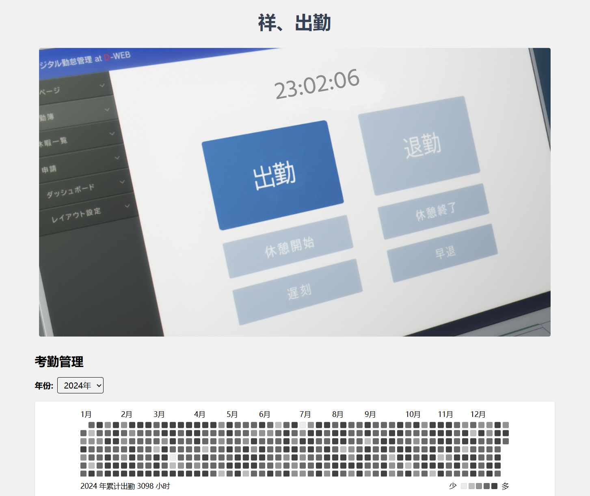
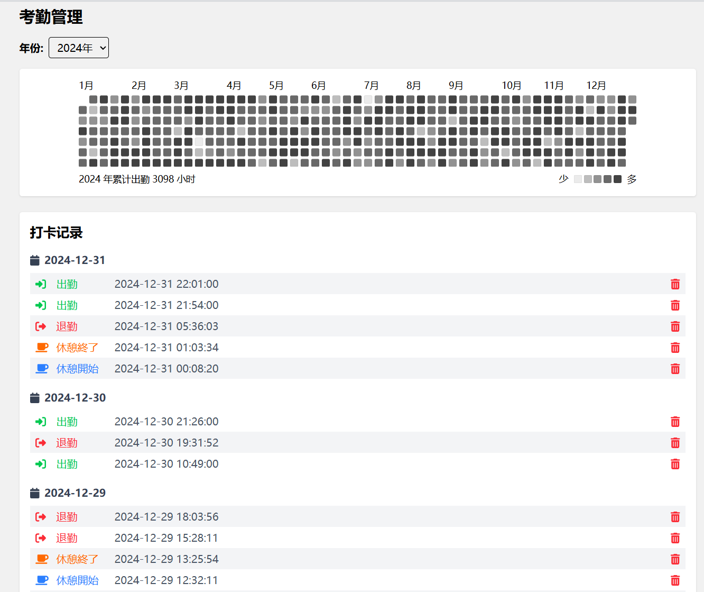

    
    <h1>祥、出勤</h1>

> 「这不是Ave Mujica的那位Ob一串字母女士吗？」 —— 同事在工位看到小祥后的反应

    
    

## ▍这是什么？

灵感源自《BanG Dream! It's MyGO!!!!!》中那位背负着「父债168亿」传说（虽然祖父已经还完）却依然坚持打工的大小姐客服小祥。

当然，祥子大小姐其实并不缺钱，毕竟她的祖父能随手掏出168亿，但**你可就不一定了**！

在这个系统里，你可以体验到：
- ✅ 豪门千金打工的华丽姿态（然而你的祖父可不会替你还168亿）  
- ✅ 沉浸式还原的剧中UI（指用截图PS后充当UI）
- ...  

## ▍功能亮点

- ⏰ 24小时制时间显示（毕竟打工人不需要睡眠）  
- 📅 自动生成年度工时汇报（建议搭配速效救心丸服用）  
- 🚨 「早退」按钮（仅供观赏，并不能点击）  
- ~~🎸 隐藏的乐队组建设定~~

## ▍使用指南

只需访问 [https://saki-shukkin.work](https://saki-shukkin.work) 即可开始“豪门千金打工”之旅。

## ▍特别鸣谢
- **若叶睦** 提供经典台词「祥、移动」  
- **Deepseek** 提供文案（虽然小祥说不需要依赖任何人）  
- **ChatGPT** 生成的前端代码
- **MyGO!!!!! 和 Ave Mujica动画组** 创造了这么屑的祥子
